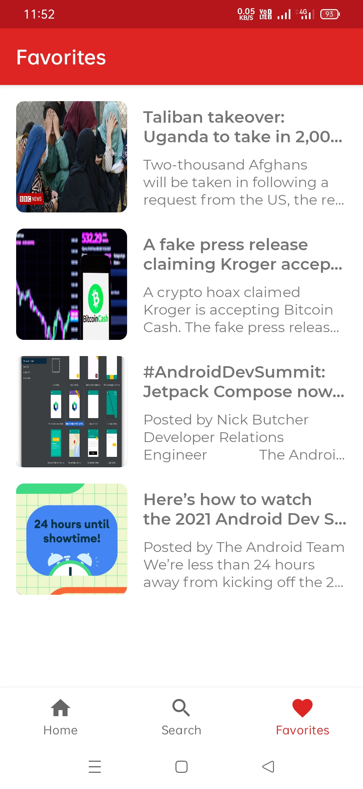

# Samachaar
Samachaar is an API based news application that fetches top headlines and also allows users to search news of any country or category.

## App Icon

# Download
App can be downloaded from [here.][1]

## Screenshots
| Screenshot 1  | Screenshot 2  | Screenshot 3 |
| --------------- | --------------- |------------|
|  |  |  |
| Screenshot 4  | Screenshot 5  | Screenshot 6 |
|  |  |  |
| Screenshot 7  | Screenshot 8  | Screenshot 9 |
|  |  |  |

## API Details
The API used in this application is from NewsApi. Can be found [here.][2]

## Author
<b>Rajit Deb</b>

## Find me on

[1]: https://github.com/rajitdeb/Samachaar/blob/7-implement-filter-button-in-search-fragment/apk/samachaar_build_sep23.apk?raw=true
[2]: https://newsapi.org/
